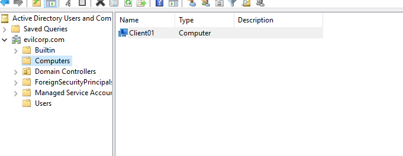
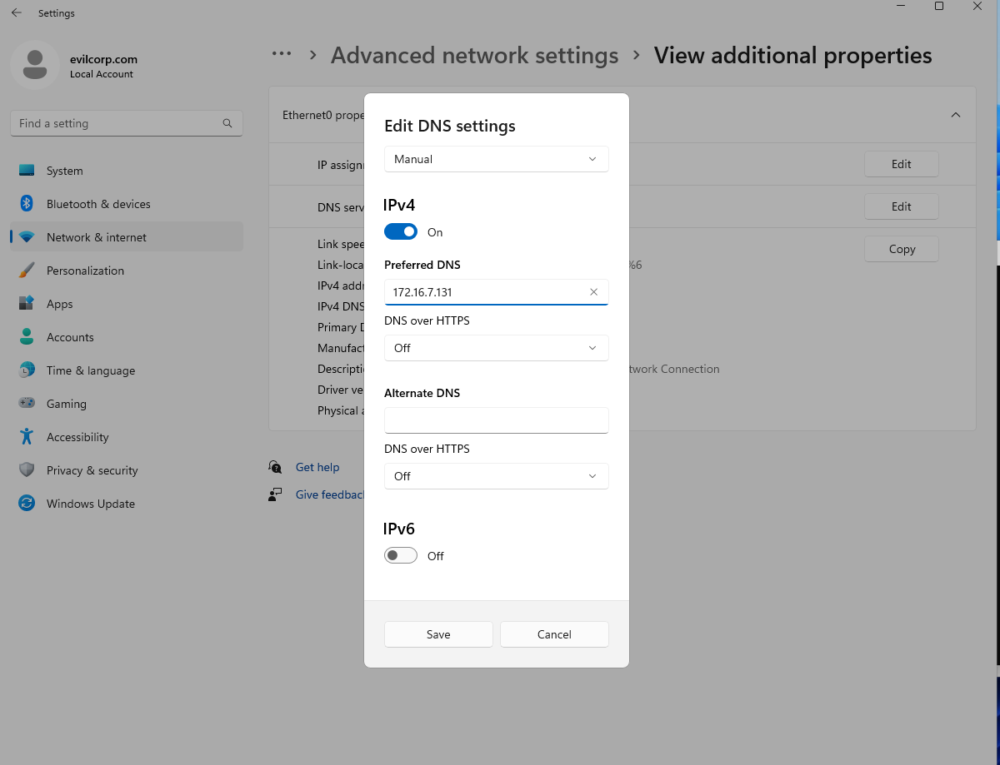
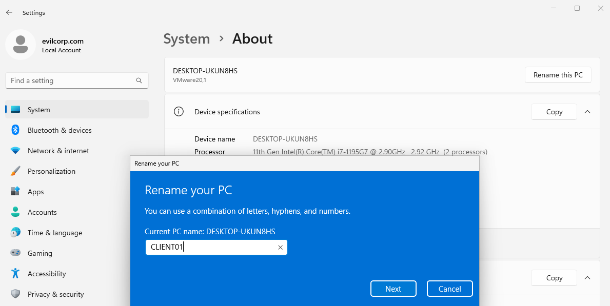
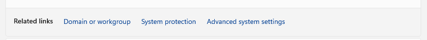
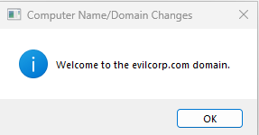
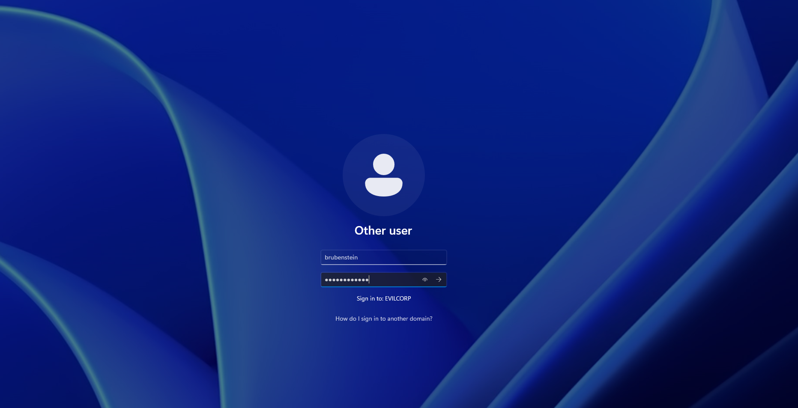

# Adding Data to Active Directory

Now that we have our Domain Controller up and running, we can start adding users, groups, network shares, and other to our domain.

## Add User&#x20;

We'll add a user through Active Directory Users and Computers.

<figure><figcaption></figcaption></figure>

Right click on Users -> New -> User. We'll create the user "Bob Rubenstein". We'll add him as an Administrator by right clicking and "Add to Group"

<figure><figcaption></figcaption></figure>

## Add Computer

We'll add a Windows 11 machine called 'CLIENT01" to our Domain first.

On our Windows 2019 Server we'll create the computer the same way we created our "brubenstein" user.

<figure><figcaption></figcaption></figure>

### Configure DNS on Windows 11 Machine

After we install the Windows 11 Evaluation machine we need to configure the DNS to point to our Windows 2019 Domain Controller.

On Windows 11 we can access the network manager with the run command:

<figure><figcaption></figcaption></figure>

<figure><figcaption>
Point to the IP address of our Domain Controller
</figcaption></figure>

### Change the Name of the Windows 11 machine.

It's important that we change the computer name match the one we added to our Domain. In this case we'll change it to "CLIENT01"

<figure><figcaption></figcaption></figure>

### Connect to Domain

We'll need to restart the computer and go to About -> Domain or Workgroup.

<figure><figcaption></figcaption></figure>

<figure><figcaption></figcaption></figure>

We'll pass the credentials we made for "brubenstein" and click "ok".

<figure><figcaption></figcaption></figure>

And there we go! We've successfully added our Windows 11 machine to our domain. We can restart and login with the user we added.

<figure><figcaption>
Log into our account from the connected machine.
</figcaption></figure>
