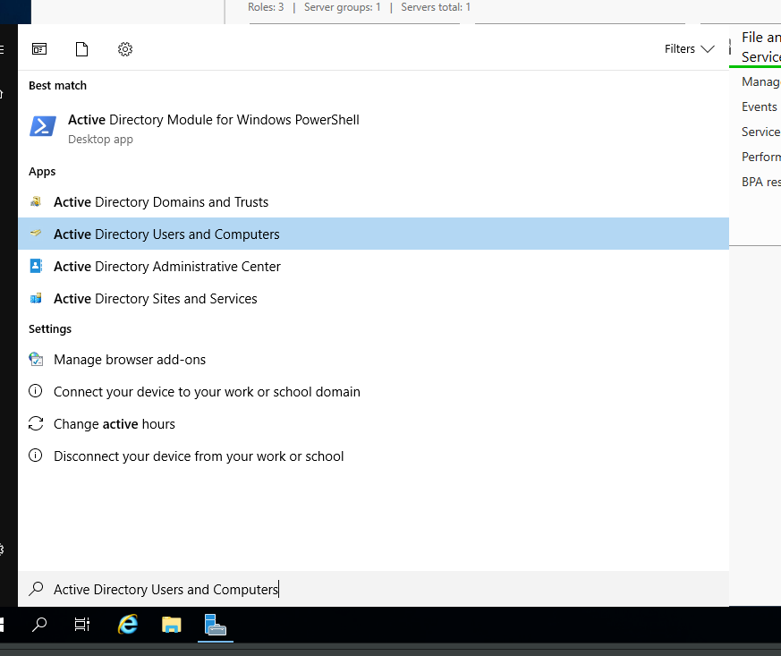
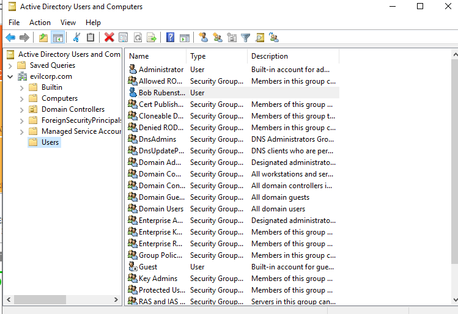

# Adding Data to Active Directory

Now that we have our Domain Controller up and running, we can start adding users, groups, network shares, and other to our domain.

## Add User&#x20;

We'll add a user through Active Directory Users and Computers.

<figure><figcaption></figcaption></figure>

Right click on Users -> New -> User. We'll create the user "Bob Rubenstein". We'll add him as an Administrator by right clicking and "Add to Group"

<figure><figcaption></figcaption></figure>

## Add Computer

