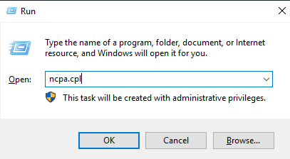
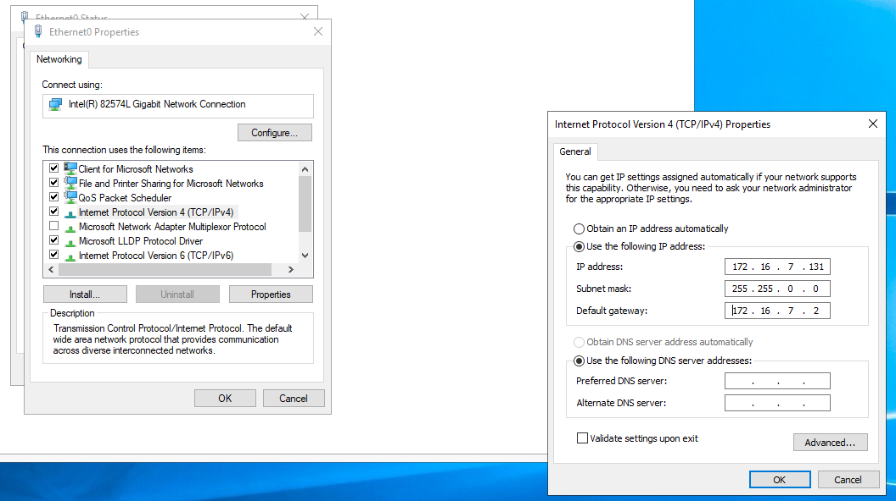

# Installing Forest

_<mark style="color:red;">**NOTE:**</mark>_ Always download evaluation copies from Microsoft.



### **Windows Server Evaluation 2019 Activation Key** <a href="#893e" id="893e"></a>

> **Windows Server** **2016** **Essentials** JCKRF-N37P4-C2D82–9YXRT-4M63B
>
> **Windows Server 2019 Standard** N69G4B89J24G8F4WWYCCJ464C
>
> **Windows Server 2019** **Datacenter** WMDGN-G9PQG-XVVXX-R3X43–63DFG

### **Windows Server Evaluation 2022 Activation Key** <a href="#7721" id="7721"></a>

> **Windows Server** **2022 Standard** VDYBN-27WPP-V4HQT-9VMD4-VMK7H
>
> **Windows Server 2022 Azure Edition** NTBV8–9K7Q8-V27C6-M2BTV-KHMXV
>
> **Windows Server 2022 Datacenter** WX4NM-KYWYW-QJJR4-XV3QB-6VM33


## Installing Windows Server

We'll be installing Windows Server 2019. Evaluation Copies are available for 2022 as well.

### Bypass Easy Install

The trick is to bypass **Easy Install**

1. First start VMware Workstation
2. Create A New Virtual Machine
3. Select the option “I will install the operating system later”
4. Then your new virtual machine will be added to your virtual library.
5. Double click on your new Virtual Machine to start it.
6. Then it will prompt that an OS is not installed and provide an option to insert the OS installation media.
7. Simply click on Change CD/DVD Settings to select your ISO media then Restart VM.

#### Make sure to choose the Desktop Experience version&#x20;

<figure><figcaption></figcaption></figure>


## Setting Up Domain Controller

Once we've installed Windows Server, we'll setup an Active Directory Domain Controller (DC) on it.


### Changing Host name

We want this to contain the proper naming convention. Ends in DC\<DC#>.

```powershell
Rename-Computer -NewName "EVLDC01" -Restart
```


### Assign Static IP&#x20;

Before we configure our server as a Domain Controller, we need to assign as Static IP. We can use network manager to do so.&#x20;

<figure><figcaption></figcaption></figure>

<figure><figcaption><p>Assigning static IP. </p></figcaption></figure>


### Adding Roles

Click "Add Roles and Features" will bring us to the installation wizard.

<figure><figcaption></figcaption></figure>

We'll add the following options to create a minimal active directory environment to start from.

<figure><figcaption></figcaption></figure>


### Promoting to Domain Controller

After we've installed the Roles we can promote the Server to Domain Controller.

<figure><figcaption></figcaption></figure>

<figure><figcaption></figcaption></figure>

### Rebooting.

Click through the the next prompts. This will configure NetBIOS name, and other pre-requisites along with show some warnings. Once we log back in our Domain Controller is ready!
