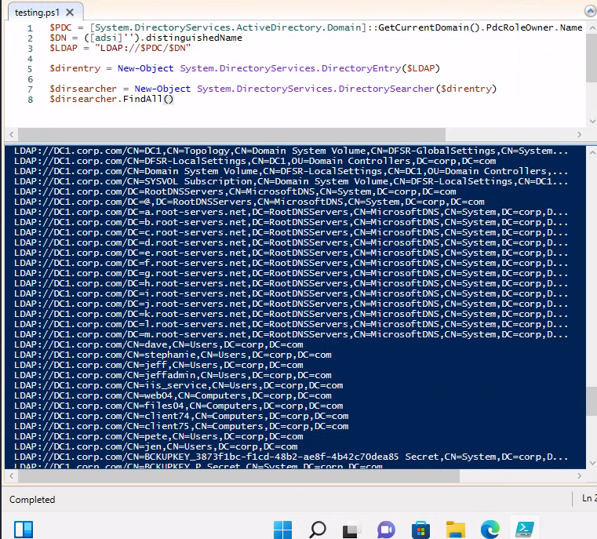
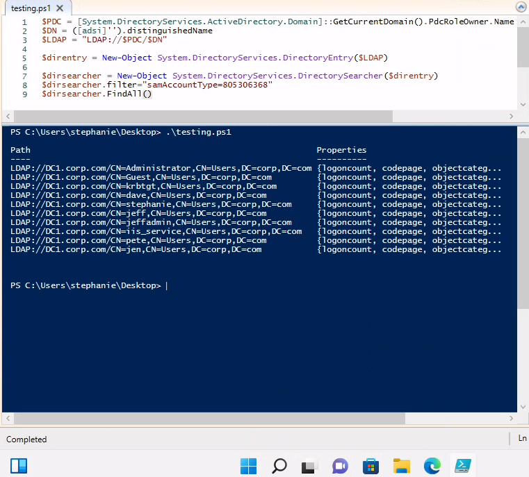
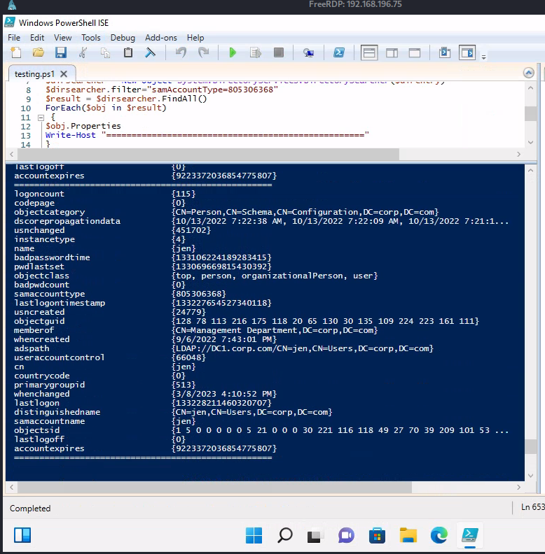

# Powershell & .NET Classes

***

## Bypassing Security

Chances are Administrators have set some type of security in place to restrict PowerShell scripts.

### Change Execution Policy

[Set-ExecutionPolicy](https://learn.microsoft.com/en-us/powershell/module/microsoft.powershell.security/set-executionpolicy?view=powershell-7.3) determines what scripts and files are allowed to run on the current session. It can be Restricted, AllSigned, RemoteSigned Unrestricted, and Bypass.

```powershell
PS C:\> powershell -ep bypass
```

<pre class="language-powershell"><code class="lang-powershell"><strong>PS C:\ Set-ExecutionPolicy -ExecutionPolicy bypass -Scope CurrentUser
</strong></code></pre>

## Developing Powershell Scripts

### Get Domain - .NET _System.DirectoryServices.ActiveDirectory_

In Microsoft .NET classes related to AD are found in the _System.DirectoryServices.ActiveDirectory namespace._

#### Get Current Domain

```powershell
PS C:\Users\stephanie> [System.DirectoryServices.ActiveDirectory.Domain]::GetCurrentDomain()

Forest                  : corp.com
DomainControllers       : {DC1.corp.com}
Children                : {}
DomainMode              : Unknown
DomainModeLevel         : 7
Parent                  :
PdcRoleOwner            : DC1.corp.com
RidRoleOwner            : DC1.corp.com
InfrastructureRoleOwner : DC1.corp.com
Name                    : corp.com
```

Let's making this into a PowerShell script file. We'll call it `testing.ps1`.

<figure><figcaption><p>Powershell ISE ftw. Change ExecutionPolicy before running!</p></figcaption></figure>

Active Directory relies on [LDAP](https://learn.microsoft.com/en-us/previous-versions/windows/desktop/ldap/lightweight-directory-access-protocol-ldap-api) as it's communication protocol. Like other protocls we can specity a URI scheme. This scheme is known as the **LDAP ADsPath**.

```
LDAP://HostName[:PortNumber][/DistinguishedName]
```

We can build out this path and use it to create our own custom communication scripts to enumerate active directory.

#### Powershell .NET script to retrieve ADsPath

```powershell
$PDC = [System.DirectoryServices.ActiveDirectory.Domain]::GetCurrentDomain().PdcRoleOwner.Name
$DN = ([adsi]'').distinguishedName 
$LDAP = "LDAP://$PDC/$DN"
$LDAP
```

## Active Directory Service Interfaces (ADSI)

We can use [ADSI](https://learn.microsoft.com/en-us/windows/win32/adsi/active-directory-service-interfaces-adsi) directly in PowerShell. This is a powerful tool when developing scripts.

```powershell
PS C:\Users\stephanie\Desktop> ([adsi]'').distinguishedName

DC=corp,DC=com
```

Now that we have the LDAP URI Path we can start to perform queries.


### Retrieving AD Entries - .NET _DirectorySearcher_

In .NET ADSI we can use the [DirectorySearcher](https://learn.microsoft.com/en-us/dotnet/api/system.directoryservices.directorysearcher?view=dotnet-plat-ext-7.0) object to perform queries against Active Directory. We'll add a FindAll() query that finds all entries in Active Directory.

```
$PDC = [System.DirectoryServices.ActiveDirectory.Domain]::GetCurrentDomain().PdcRoleOwner.Name
$DN = ([adsi]'').distinguishedName 
$LDAP = "LDAP://$PDC/$DN"

# Add Query to our script.
$direntry = New-Object System.DirectoryServices.DirectoryEntry($LDAP)

$dirsearcher = New-Object System.DirectoryServices.DirectorySearcher($direntry)
$dirsearcher.FindAll()
```

<figure><figcaption><p>FindAll() retrievies all entries in the entire domain.</p></figcaption></figure>

The above image returns all entries in the entire domain. This is a lot of information, it's best to filter out what we're looking for.


### Filter AD Entries - Find All Users

One way we can find all users is by Sam-Account-Type. This is the attribute applied to all users, computers, and group objects.

* SAM\_USER\_OBJECT            0x30000000
* SAM\_GROUP\_OBJECT         0x10000000
* SAM\_MACHINE\_ACCOUNT 0x30000001

```
$dirsearcher.filter="samAccountType=805306368" #0x30000000 in decimal 
```

<figure><figcaption><p>Fetch all Users in AD with samAccountType. 0x3000000</p></figcaption></figure>

#### Printing User Properties

Let's loop through the newly created Users object and print all the properties for each entry.

<pre class="language-powershell"><code class="lang-powershell">$dirsearcher.filter="samAccountType=805306368"
$result = $dirsearcher.FindAll()
ForEach($obj in $result) {
<strong>    $obj.Properties
</strong>    Write-Host "==================================================="
}
</code></pre>

<figure><figcaption><p>Listing all properties in user object. Yields lots of information!</p></figcaption></figure>
