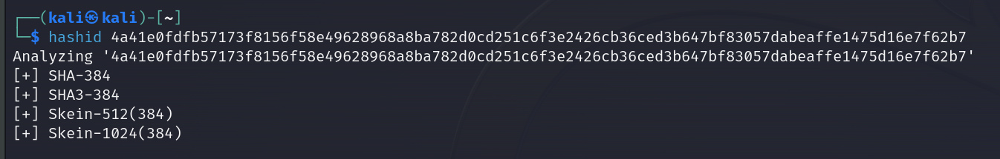

# Password Cracking Prerequisites

The process of Cracking Passwords is as follows:

1. Extract hashes
2. Format hashes
3. Calculate the cracking time
4. Prepare wordlist
5. Attack the hash

### Formatting Hashes

Once we extract password hashes we need to format them based on the hashing algorithm. Here are tools to help identify hashing algorithms:





<figure><figcaption></figcaption></figure>

### Wordlist Preparation

In nearly all cases we'll need to mutate our wordlist and perform a rule-based attack based on the password policy in place.

### CeWL

CeWL (Custom Wordlist Generator) is a tool we can use that spiders a website and outputs a wordlist.&#x20;



