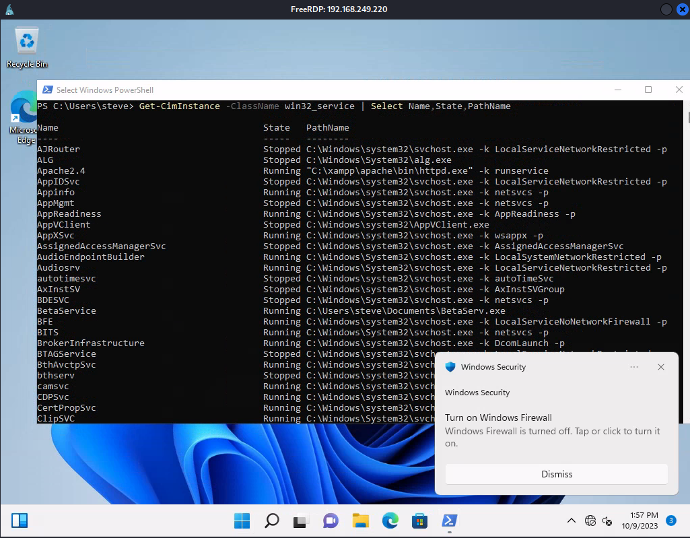

# Abusing Unquoted Paths

***

## Background

When a Windows service is started, Win32 API [CreateProcess](https://learn.microsoft.com/en-us/windows/win32/api/processthreadsapi/nf-processthreadsapi-createprocessa) is called. `lpApplicationName` is the name of the executable and optionally the full path. If the provided string contains spaces and is not inclosed in quotation marks, it can be interpreted in various ways.

```c
BOOL CreateProcessA(
  [in, optional]      LPCSTR                lpApplicationName,
  [in, out, optional] LPSTR                 lpCommandLine,
  [in, optional]      LPSECURITY_ATTRIBUTES lpProcessAttributes,
  [in, optional]      LPSECURITY_ATTRIBUTES lpThreadAttributes,
  [in]                BOOL                  bInheritHandles,
  [in]                DWORD                 dwCreationFlags,
  [in, optional]      LPVOID                lpEnvironment,
  [in, optional]      LPCSTR                lpCurrentDirectory,
  [in]                LPSTARTUPINFOA        lpStartupInfo,
  [out]               LPPROCESS_INFORMATION lpProcessInformation
);
```

Let's say we have the lpApplicationName of `C:\Program Files\My Program\My service\service.exe`

We can try to abuse this by adding .`exe` to the end of each space.

```
C:\Program.exe
C:\Program Files\My.exe
C:\Program Files\My Program\My.exe
C:\Program Files\My Program\My service\service.exe
```

We create a malicious binary and place it in each directory shown above.

## Example

### Enumerating Services

#### Commands:

```
Get-CimInstance -ClassName win32_service | Select Name,State,PathName 
```

```
wmic service get name,pathname | findstr /i /v "C:\Windows\" | findstr /i /v """
```

We start by enumerating services and find the ones that have spaces in their filepaths.

<figure><figcaption></figcaption></figure>

## Enumerating Permissions

Once we've enumerated the installed service and found one of interest, we can view the permissions.  We can use tools like: _**icacls**_ Windows utility or the PowerShell Cmdlet _**Get-ACL**_

| MASK | PERMISSIONS             |
| ---- | ----------------------- |
| F    | Full access             |
| M    | Modify access           |
| RX   | Read and execute access |
| R    | Read-only access        |
| W    | Write-only access       |

###

### Checking Permissions

We need to make sure we have permissions in each path that we want to add our malicios binary:

```
PS C:\Users\user> icacls "C:\"
C:\ BUILTIN\Administrators:(OI)(CI)(F)
    NT AUTHORITY\SYSTEM:(OI)(CI)(F)
    BUILTIN\Users:(OI)(CI)(RX)
    NT AUTHORITY\Authenticated Users:(OI)(CI)(IO)(M)
    NT AUTHORITY\Authenticated Users:(AD)
    Mandatory Label\High Mandatory Level:(OI)(NP)(IO)(NW)
    
Successfully processed 1 files; Failed processing 0 files
    
PS C:\Users\steve>icacls "C:\Program Files"
C:\Program Files NT SERVICE\TrustedInstaller:(F)
                 NT SERVICE\TrustedInstaller:(CI)(IO)(F)
                 NT AUTHORITY\SYSTEM:(M)
                 NT AUTHORITY\SYSTEM:(OI)(CI)(IO)(F)
                 BUILTIN\Administrators:(M)
                 BUILTIN\Administrators:(OI)(CI)(IO)(F)
                 BUILTIN\Users:(RX)
                 BUILTIN\Users:(OI)(CI)(IO)(GR,GE)
                 CREATOR OWNER:(OI)(CI)(IO)(F)
...

```

### We then copy out executable to these file paths and rename them accordingly. Don't forget to delete them after your finished & restore the original binary!
