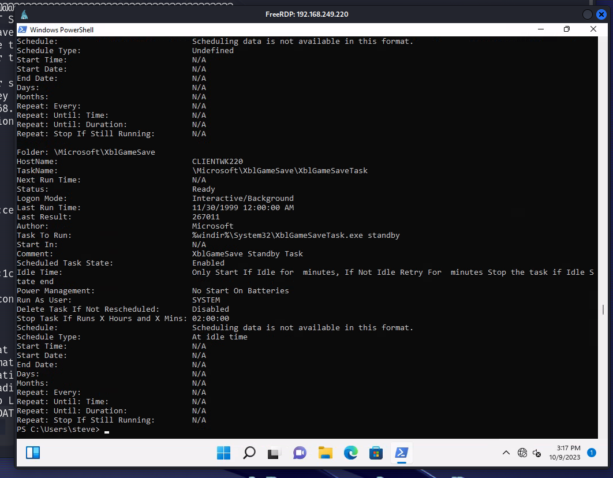

# Scheduled Tasks

## About Scheduled Tasks

Scheduled Tasks, or Tasks, are defined by a **trigger**. A trigger can be set on a time or date, on startup, on log in, or any other condition.

#### What to look for in Tasks:

* As which user does this task get executed?
* What triggers are specified for the task?
* What actions are executed when one or more of these triggers are met?

These questions are vital to see if a task can lead to privilege escalation.

## Enumerating Scheduled Tasks

We can view scheduled tasks on Windows with the [_Get-ScheduledTask_](https://learn.microsoft.com/en-us/powershell/module/scheduledtasks/get-scheduledtask?view=windowsserver2022-ps) Cmdlet or the command **schtasks /query**.

```
PS> schtasks /query /fo LIST /v
```

<figure><figcaption></figcaption></figure>

_<mark style="color:red;">**NOTE:**</mark>_ There are a lot of Scheduled Tasks that run on Windows. This will take time to enumerate but can reveal important information about the host machine.

## Replacing Scheduled Task Executable w/ Malicious Binary

Like we did with Service hijacking. We find the full path of the scheduled task binary file and replace it with our own. We have to enumerate permissions!.

## Enumerating Permissions

Once we've enumerated the installed service and found one of interest, we can view the permissions.  We can use tools like: _**icacls**_ Windows utility or the PowerShell Cmdlet _**Get-ACL**_

| MASK | PERMISSIONS             |
| ---- | ----------------------- |
| F    | Full access             |
| M    | Modify access           |
| RX   | Read and execute access |
| R    | Read-only access        |
| W    | Write-only access       |


### Checking Permissions

```
PS C:\Users\user> icacls "C:\ScheduledTask\"
C:\ BUILTIN\Administrators:(OI)(CI)(F)
    NT AUTHORITY\SYSTEM:(OI)(CI)(F)
    BUILTIN\Users:(OI)(CI)(RX)
    NT AUTHORITY\Authenticated Users:(OI)(CI)(IO)(M)
    NT AUTHORITY\Authenticated Users:(AD)
    Mandatory Label\High Mandatory Level:(OI)(NP)(IO)(NW)
```

#### We use our preferred method of transfering the malicious binary to the location and it will be executed the next time the scheduled task is run.


## Create Scheduled Task

We can create as

```powershell
schtasks /create /tn "CopyTask" /tr "copy C:\Test\BetaLibrary.Dll C:\BetaMonitor\BetaLibary.Dll" /sc once /st 00:00
```
