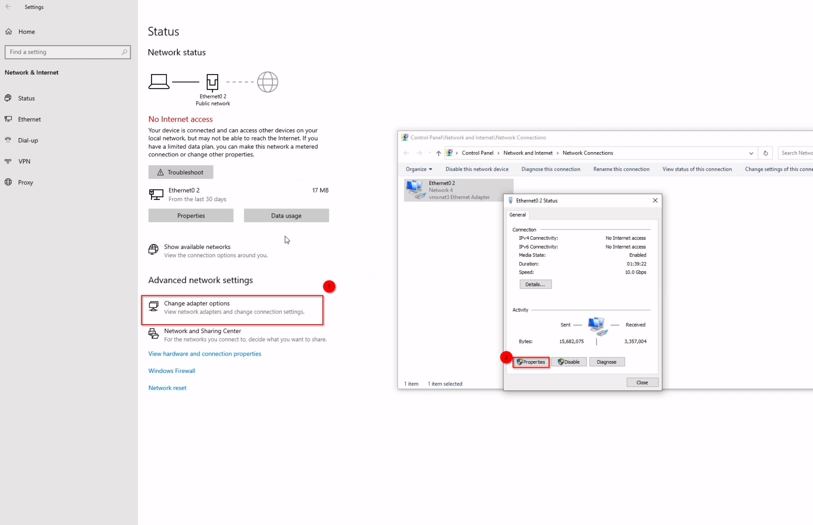

# Setting up Pwn Box

## Installing Windows 11 Evaluation Image

The first step is to install Windows 11. Like most people, I like to get things for free. We can get a free Windows 11 ISO from the Windows evaluation center. You will need a domain joined email account.


The eval image gives us 90 days to evaluate windows 11. If you can't develop your malware in 90 days then maybe you should switch to  javascript.


<figure><figcaption></figcaption></figure>

I won't go into detail on setting up the virtual machine. Any vm provider will do. I like VMware Workstation.

## Installing Microsoft Office

We wan't our pwnbox to resemble a realistic host environment. It will contain common enterprise Microsoft applications; Teams, Excel, Word, Skype, Google Chrome, and others.

## Create Tools Folder

We will create a Tools folder at C:\Tools\\. When developing our programs, we'll need to omit this folder path.

<figure><figcaption></figcaption></figure>

## Create Snapshot

Create a snapshot of this current state before the installation of our 7 day free office trial.&#x20;
