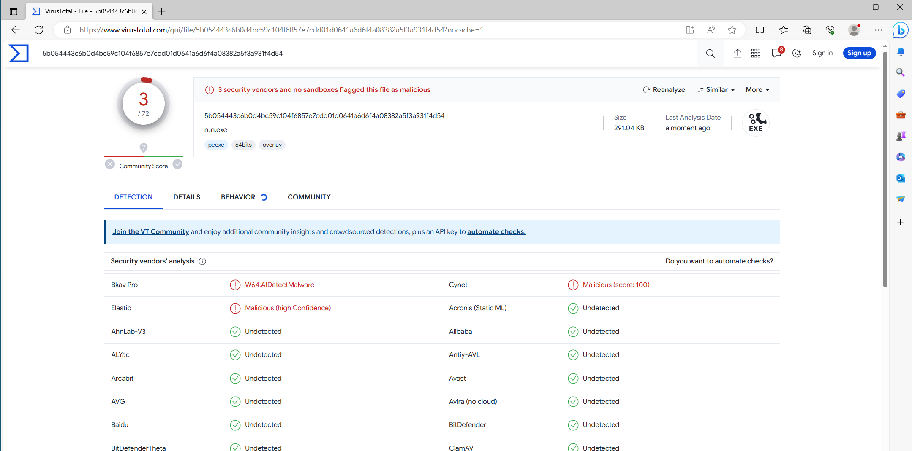
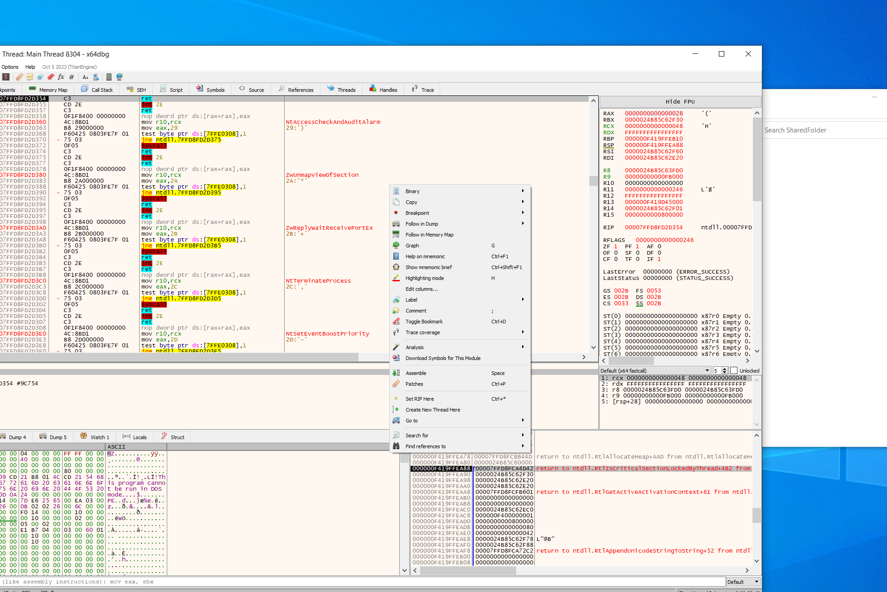
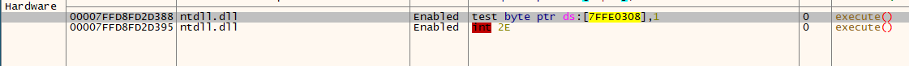

# Check If Running In a Debugger

## Theory & Goals

When writing malware we should always including anti-debugging techniques in our programs to make them more time-consuming to analyze.

For example, the simplest method of checking if we're in a debugger is using `IsDebuggerPresent()`. This is not a practical approach, but you can the jist of what the goal is.

```c
if (IsDebuggerPresent()) {
  printf("[i] IsDebuggerPresent detected a debugger \n");
  // Run harmless code..
}

```

## Evading Security Monitors

Including known anti-debugging techniques in our programs will likely draw suspicion anyone / anything monitoring our programs execution. This code alone is signatured by some AV.

```c
//
#include <wchar.h>
#include <windows.h>

int wmain() {

    if (IsDebuggerPresent()) {
        wprintf(L"Debugger Present");
    } else {
        wprintf(L"Debugger Not Present");
    }
    return 0;
}
```

<figure><figcaption></figcaption></figure>

## Using NTAPI

A better method is to use `NtQueryInformationProcess` to avoid user-land hooks.

<pre class="language-c" data-full-width="true"><code class="lang-c">QueryInformationProcess = (NtQueryInformationProcess)GetProcAddress(GetModuleHandle(TEXT("NTDLL.DLL")), "NtQueryInformationProcess");
if (pNtQueryInformationProcess == NULL) {
	printf("\t[!] GetProcAddress Failed %d\n", GetLastError());
	return FALSE;
}

STATUS = QueryInformationProcess(
<strong>		GetCurrentProcess(),
</strong>		ProcessDebugPort,
		&#x26;dwIsDebuggerPresent,
		sizeof(DWORD64),
		NULL
);
</code></pre>

_<mark style="color:red;">**NOTE:**</mark>_ The important argument here is `ProcessDebugPort`: _A nonzero value indicates that the process is being run under the control of a ring 3 debugger. **This code is only valid if a debugger is using hardware breakpoints!**_

###

## Hardware Breakpoints

### What are hardware breakpints

As mentioned above, the code that we used to execute NtQueryInformationProcess with ProcessDebugPort only works if a debugger is using hardware breakpoints.

_<mark style="color:blue;">**TL:DR**</mark>_ - Hardware breakpoints are a feature in modern processors that pause the execution of a process when a memory address or event is reached.

The registers `Dr0`, `Dr1`, `Dr2` are used by developers, reverse engineers, and security researchers to perform tasks such as breakpoint debugging and memory access monitoring.

### Setting Hardware Breakpoints in X64Dbg

In this example we'll set two hardware breakpoints

<figure><figcaption><p>Right-Click -> Breakpoint -> Set Hardware Breakpoint</p></figcaption></figure>


### Viewing Hardware Breakpoints in x64Dbg

In the "Breakpoints" tab we can view our Hardware breakpoints.

<figure><figcaption><p>Our two hardware breakpoints</p></figcaption></figure>

### Viewing DR Register

On the far-right FPU panel we can scroll down until we see our active DR register addresses. A

<figure><figcaption><p>Here are the addresses of the two hardware breakpoints we set.</p></figcaption></figure>

## VX-API

VX-API has some useful functions we can use to implement anti-debugging in our programs

### [Anti-debug](https://github.com/vxunderground/VX-API#anti-debug) <a href="#user-content-anti-debug" id="user-content-anti-debug"></a>

| Function Name                       | Original Author     |
| ----------------------------------- | ------------------- |
| AdfCloseHandleOnInvalidAddress      | Checkpoint Research |
| AdfIsCreateProcessDebugEventCodeSet | Checkpoint Research |
| AdfOpenProcessOnCsrss               | Checkpoint Research |
| CheckRemoteDebuggerPresent2         | ReactOS             |
| IsDebuggerPresentEx                 | smelly\_\_vx        |
| IsIntelHardwareBreakpointPresent    | Checkpoint Research |


Blog Post w/ Other Techniques

