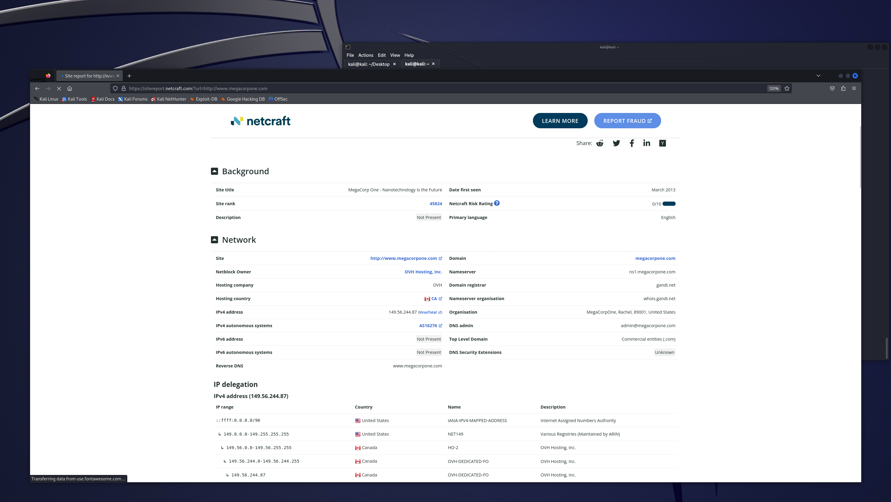

# External Recon and Enumeration

This can be as simple as gleaning a username format from the customer's main website or social media. Any information that allows us to dive deeper into the target is what we're looking for.


Scanning Github & other CI/CD platforms for possible credentials, sensitive documents, or links to an intranet or resources. Or just information that gives use a view on how the enterprise environment is configured.

### What Are We Looking For?

| **Data Point**       | **Description**                                                                                                                                                                                                                                                                                                                                                                                                                                 |
| -------------------- | ----------------------------------------------------------------------------------------------------------------------------------------------------------------------------------------------------------------------------------------------------------------------------------------------------------------------------------------------------------------------------------------------------------------------------------------------- |
| `IP Space`           | Valid ASN for our target, netblocks in use for the organization's public-facing infrastructure, cloud presence and the hosting providers, DNS record entries, etc.                                                                                                                                                                                                                                                                              |
| `Domain Information` | Based on IP data, DNS, and site registrations. Who administers the domain? Are there any subdomains tied to our target? Are there any publicly accessible domain services present? (Mailservers, DNS, Websites, VPN portals, etc.) Can we determine what kind of defenses are in place? (SIEM, AV, IPS/IDS in use, etc.)                                                                                                                        |
| `Schema Format`      | Can we discover the organization's email accounts, AD usernames, and even password policies? Anything that will give us information we can use to build a valid username list to test external-facing services for password spraying, credential stuffing, brute forcing, etc.                                                                                                                                                                  |
| `Data Disclosures`   | For data disclosures we will be looking for publicly accessible files ( .pdf, .ppt, .docx, .xlsx, etc. ) for any information that helps shed light on the target. For example, any published files that contain `intranet` site listings, user metadata, shares, or other critical software or hardware in the environment (credentials pushed to a public GitHub repo, the internal AD username format in the metadata of a PDF, for example.) |
| `Breach Data`        | Any publicly released usernames, passwords, or other critical information that can help an attacker gain a foothold.                                                                                                                                                                                                                                                                                                                            |

Where Are We Looking?

| **Resource**                     | **Examples**                                                                                                                                                                                                                                                                                                                                                                                                                             |
| -------------------------------- | ---------------------------------------------------------------------------------------------------------------------------------------------------------------------------------------------------------------------------------------------------------------------------------------------------------------------------------------------------------------------------------------------------------------------------------------- |
| `ASN / IP registrars`            | [IANA](https://www.iana.org/), [arin](https://www.arin.net/) for searching the Americas, [RIPE](https://www.ripe.net/) for searching in Europe, [BGP Toolkit](https://bgp.he.net/)                                                                                                                                                                                                                                                       |
| `Domain Registrars & DNS`        | [Domaintools](https://www.domaintools.com/), [PTRArchive](http://ptrarchive.com/), [ICANN](https://lookup.icann.org/lookup), manual DNS record requests against the domain in question or against well known DNS servers, such as `8.8.8.8`.                                                                                                                                                                                             |
| `Social Media`                   | Searching Linkedin, Twitter, Facebook, your region's major social media sites, news articles, and any relevant info you can find about the organization.                                                                                                                                                                                                                                                                                 |
| `Public-Facing Company Websites` | Often, the public website for a corporation will have relevant info embedded. News articles, embedded documents, and the "About Us" and "Contact Us" pages can also be gold mines.                                                                                                                                                                                                                                                       |
| `Cloud & Dev Storage Spaces`     | [GitHub](https://github.com/), [AWS S3 buckets & Azure Blog storage containers](https://grayhatwarfare.com/), [Google searches using "Dorks"](https://www.exploit-db.com/google-hacking-database)                                                                                                                                                                                                                                        |
| `Breach Data Sources`            | [HaveIBeenPwned](https://haveibeenpwned.com/) to determine if any corporate email accounts appear in public breach data, [Dehashed](https://www.dehashed.com/) to search for corporate emails with cleartext passwords or hashes we can try to crack offline. We can then try these passwords against any exposed login portals (Citrix, RDS, OWA, 0365, VPN, VMware Horizon, custom applications, etc.) that may use AD authentication. |

_<mark style="color:red;">**TOOLING:**</mark>_

_**ASN/IP & Domain Data:**_

The `BGP-Toolkit` hosted by [Hurricane Electric](http://he.net/) is a fantastic resource for researching what address blocks are assigned to an organization and what ASN they reside within.&#x20;

<figure><figcaption></figcaption></figure>

_**DNS:**_

DNS is a great way to validate our scope and find out about reachable hosts the customer did not disclose in their scoping document. Sites like [domaintools](https://whois.domaintools.com/), and [viewdns.info](https://viewdns.info/) are great spots to start.

<figure><figcaption></figcaption></figure>

<figure><figcaption><p>Using Dig</p></figcaption></figure>


Great tool for discovering possible subdomains


_**Public Data:**_

Social media can be a treasure trove of interesting data that can clue us in to how the organization is structured, what kind of equipment they operate, potential software and security implementations, their schema, and more. On top of that list are job-related sites like LinkedIn, Indeed.com, and Glassdoor

#### Sharepoint Admin Job Listing

Here we understand more of the inner workings of their company tooling.

<figure><figcaption><p>You can learn a lot about an organization just from what they post</p></figcaption></figure>

_<mark style="color:red;">**IMPORTANT:**</mark>_ Websites hosted by the organization are also great places to dig for information. We can gather contact emails, phone numbers, organizational charts, published documents, etc. These sites, specifically the embedded documents, can often have links to internal infrastructure or intranet sites that you would not otherwise know about.

_**Searching Github:**_

Tools like [Trufflehog](https://github.com/trufflesecurity/truffleHog) and sites like [Greyhat Warfare](https://buckets.grayhatwarfare.com/) are fantastic resources for finding these breadcrumbs.

_**Google Dorking:**_

[_**https://taksec.github.io/google-dorks-bug-bounty/**_](https://taksec.github.io/google-dorks-bug-bounty/)

<figure><figcaption></figcaption></figure>

```
site: google.com ext:log | ext:txt | ext:conf | ext:cnf | ext:ini | ext:env | ext:sh | ext:bak | ext:backup | ext:swp | ext:old | ext:~ | ext:git | ext:svn | ext:htpasswd | ext:htaccess

site:target.com -www.target.com -it.target.com
site:target.com inurl:login
site:target.com filetype:xml web development
site:target.com filetype:txt
site:target.com filetype:pdf
site:target.com filetype:pdf "financial reports"
link:target.com
```


_**Credential Hunting:**_

[Dehashed](http://dehashed.com/) is an excellent tool for hunting for cleartext credentials and password hashes in breach data.&#x20;

```shell-session
attacker@kali$ sudo python3 dehashed.py -q inlanefreight.local -p

id : 5996447501
email : roger.grimes@inlanefreight.local
username : rgrimes
password : Ilovefishing!
hashed_password : 
name : Roger Grimes
vin : 
address : 
phone : 
database_name : ModBSolutions
```

\


#### Netcraft



<figure><figcaption></figcaption></figure>
